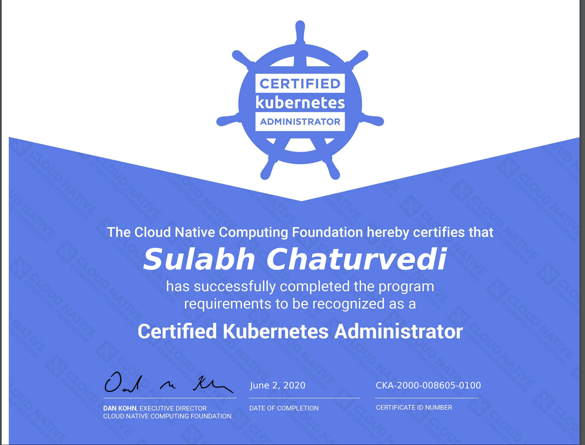

I recently passed my CKA exam with 92%. While prepping for the exam, I had read a lot of blogs about the CKA exam and found each of them very helpful. So, I decided to share my experience as well.

**Disclaimer**: Everything mentioned in this blog is my own experience/thoughts.

## Exam Overview

- This is a practical exam with 24 questions, the exam covers all scenarios that, you'll most probably encounter as a Kubernetes Cluster admin i.e. from installing a cluster to operating/managing multiple clusters.
- Kubernetes version: 1.18 (on the date of writing this blog)
- [Exam curriculum](https://github.com/cncf/curriculum)
- You're allowed to open **only one other tab** in the browser and you can browse at [Official docs](https://kubernetes.io/docs/)​, [GitHub Repo](​https://github.com/kubernetes/)​, [Official blog](https://kubernetes.io/blog/​) and their subdomains.

## Skills needed to clear the exam

- Kubernetes (obviously)
- Docker (troubleshooting with docker ps, docker logs etc.)
- Basic Linux system administration ( systemd, journalctl, file permissions, package management, basic bash scripting, and commands (cat, here-doc, tr, awk, cut, sed, netstat/ss, ps, tee, etc.) vim, etc. )

## Prep Work

I did following in exact order and it took around ~2 months from preparation to the exam (I could only give 1 to 2 hours a day to prepare for the exam and I wasn't actively working on Kubernetes from past 6 months)

- [Linux Academy: CKA Prep course](https://linuxacademy.com/course/cloud-native-certified-kubernetes-administrator-cka/)
- [Linux Academy: Learn Kubernetes by Doing](https://linuxacademy.com/course/learn-kubernetes-by-doing/)
- [KodeCloud practice tests](https://kodekloud.com/p/certified-kubernetes-administrator-with-practice-tests)
- [Be fast with Kubectl run - 1.18](https://medium.com/faun/be-fast-with-kubectl-1-18-ckad-cka-31be00acc443)
- [A practice exam from killer.sh](https://killer.sh/cka)
- [Kubernetes.io tasks: Administer the cluster](https://kubernetes.io/docs/tasks/)

## Getting help from the community

[Kubernetes Slack: join channel #cka-prep](https://kubernetes.slack.com/)

## Less than 24 hours before the exam

Finally, I prepped a list of questions that, I was struggling with and I implemented those questions a day before the exam and just a few hours before the exam.

Technically, I bootstrapped my own kubeadm clusters, broke it and played enough with it.

> Here a takeaway for me was, **use calico for CNI, if you're asked to bootstrap the cluster**. Why? Because weave-net and others many at times gives an error when a custom pod-cidr is not provided. whereas, Calico will automatically detect which IP address range to use for pod IPs based on the value provided via the --pod-network-cidr flag or via kubeadm’s configuration.

## Final Words

You may be thinking, Did I over-prepare? Maybe. But, was it worth it? Absolutely, I gained a lot of confidence, I felt very well-prepared and **I finished my exam 25 minutes before**, that's right 25 minutes.

**My advice to all aspirants is, prepare well, know your craft, practice a lot and go ace it.**

